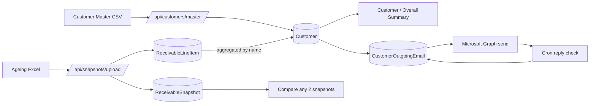

## Scope confirmed from clarifications

- Customer identity: **by normalized Customer Name**; merge across codes. A customer can hold multiple `customerCode` values seen in uploads.
- Customer master: CSV round-trip (download empty/current → fill emails → re-upload) with name + codes + emailTo + emailCc + excluded columns.
- Email content: HTML body + **inline HTML table of that customer's line items** (no attachment).
- Excluded list: both UI toggle and CSV import, can be included back.
- Comparison: **full** (invoice-level added / cleared / amount-changed + per-customer + per-company deltas + ageing-bucket migration + newly-overdue + receipts recognized).
- Retention: rolling **last N** snapshots (configurable in settings, default 12).

## Target architecture



## What to keep vs. replace

Keep: `User`, `Session`, `EmailConfig`, `AppSettings`, [src/lib/simple-auth.ts](src/lib/simple-auth.ts), [src/lib/graph-mail-service.ts](src/lib/graph-mail-service.ts), [src/lib/email-config-service.ts](src/lib/email-config-service.ts), reply-polling pattern from [src/lib/confirmation-service.ts](src/lib/confirmation-service.ts) and [src/lib/cron-service.ts](src/lib/cron-service.ts), instrumentation in [src/instrumentation.ts](src/instrumentation.ts), admin user CRUD under [src/app/api/users](src/app/api/users) and [src/app/users](src/app/users).

Delete / retire: `ConfirmationRecord`, `Sender`, `EmailTracking`, `EmailReply`, `ForwardingRule`, `Forwarder`, `Email`, plus pages/APIs/components tied to them — [src/app/confirmations](src/app/confirmations), [src/app/senders](src/app/senders), [src/app/forwarders](src/app/forwarders), [src/app/forwarding-rules](src/app/forwarding-rules), [src/app/forwarded-emails](src/app/forwarded-emails), [src/app/recipients](src/app/recipients), [src/app/documents](src/app/documents), [src/app/bulk-email](src/app/bulk-email) (replaced), [src/app/reports](src/app/reports) (replaced), and their APIs + components. Authority-letter/PDF flow in [src/lib/confirmation-service.ts](src/lib/confirmation-service.ts) is removed (puppeteer dep can be dropped).

## New Prisma schema (added to [prisma/schema.prisma](prisma/schema.prisma))

```prisma
model Customer {
  id             String   @id @default(cuid())
  name           String                            // original casing (most recent)
  normalizedName String   @unique                  // lowercased/trimmed key
  codesJson      String                            // JSON array of all Customer Codes seen
  companiesJson  String                            // JSON array of distinct Company Code/Name
  emailTo        String?                           // comma-separated
  emailCc        String?                           // comma-separated
  excluded       Boolean  @default(false)          // skip in summaries/emails
  notes          String?
  userId         String
  createdAt      DateTime @default(now())
  updatedAt      DateTime @updatedAt
  lines          ReceivableLineItem[]
  emails         CustomerOutgoingEmail[]
  @@map("customers")
}

model ReceivableSnapshot {
  id            String   @id @default(cuid())
  snapshotDate  DateTime                           // parsed from row 6 (e.g. 15.03.2026)
  sourceFile    String                             // saved xlsx path
  totalBalance  Float    @default(0)
  rowCount      Int      @default(0)
  customerCount Int      @default(0)
  bucketsJson   String                             // grand-total per bucket
  uploadedById  String
  createdAt     DateTime @default(now())
  lines         ReceivableLineItem[]
  @@map("receivable_snapshots")
}

model ReceivableLineItem {
  id                String   @id @default(cuid())
  snapshotId        String
  customerId        String
  companyCode       String?
  companyName       String?
  customerCode      String?
  customerName      String?
  reconAccount      String?
  reconDescription  String?
  postingDate       DateTime?
  docDate           DateTime?
  netDueDate        DateTime?
  generationMonth   String?
  documentNo        String?
  documentType      String?
  refNo             String?
  invoiceRefNo      String?
  profitCenter      String?
  profitCenterDescr String?
  specialGL         String?
  specialGLDescr    String?
  totalBalance      Float   @default(0)
  notDue            Float   @default(0)
  d0_30             Float   @default(0)
  d31_90            Float   @default(0)
  d91_180           Float   @default(0)
  d181_365          Float   @default(0)
  d366_730          Float   @default(0)
  d731_1095         Float   @default(0)
  d1096_1460        Float   @default(0)
  d1461_1845        Float   @default(0)
  above1845         Float   @default(0)
  paymentDate       DateTime?
  paymentDocNo      String?
  paymentAmount     Float?
  fromBillDate      Float?
  fromDueDate       Float?
  weights           Float?
  weightedDaysBill  Float?
  weightedDaysDue   Float?
  // Stable key for cross-snapshot diff
  dedupeKey         String                         // hash(companyCode|customerCode|documentNo|invoiceRefNo)
  snapshot          ReceivableSnapshot @relation(fields: [snapshotId], references: [id], onDelete: Cascade)
  customer          Customer @relation(fields: [customerId], references: [id], onDelete: Cascade)
  @@index([snapshotId, customerId])
  @@index([snapshotId, dedupeKey])
  @@map("receivable_line_items")
}

model CustomerOutgoingEmail {
  id              String   @id @default(cuid())
  customerId      String
  snapshotId      String                             // snapshot used to render line-item table
  subject         String
  toEmail         String
  ccEmail         String?
  htmlBody        String
  status          String   @default("pending")       // pending|sent|failed|followup_sent|reply_received
  sentAt          DateTime?
  messageId       String?                            // Graph ID for threading
  conversationId  String?
  savedHtmlPath   String?                            // saved sent HTML on disk
  errorMessage    String?
  followupCount   Int      @default(0)
  followupsJson   String?                            // [{sentAt, messageId, filePath}]
  lastReplyAt     DateTime?
  repliesJson     String?                            // [{receivedAt, messageId, subject, fromEmail, fromName, htmlBody, filePath, attachmentsJson}]
  userId          String
  emailConfigId   String?
  createdAt       DateTime @default(now())
  updatedAt       DateTime @updatedAt
  customer        Customer @relation(fields: [customerId], references: [id], onDelete: Cascade)
  @@index([customerId, snapshotId])
  @@map("customer_outgoing_emails")
}
```

`AppSettings` gains `snapshotRetentionCount Int @default(12)` and keeps reply-check fields.

## Phased delivery

### Phase 1 — Rebrand + ingest + customer master (foundation)

Goal: app is renamed, logos swapped, Excel files upload and populate the database, customer master CSV round-trip works, excluded list works, line-item viewer is available.

- Swap branding:
  - `package.json` name → `receivable-tracker`; update [README.md](README.md), [src/app/layout.tsx](src/app/layout.tsx) title/metadata.
  - [src/components/Sidebar.tsx](src/components/Sidebar.tsx) header: replace single logo with a row of `/logo.png` (Taxteck) + "×" separator + `/cleanmax-logo.jpeg` (CleanMax), app title "Receivable Tracker" beneath.
  - New nav: Dashboard, Snapshots, Customers, Emails, Compare, Email Config, Settings, Users (admin only). Drop old links.
- Prisma migration:
  - Add new models above, keep `User`/`Session`/`EmailConfig`/`AppSettings`, drop retired models.
  - Update [prisma/seed.ts](prisma/seed.ts) to seed admin only.
- Ingestion library `src/lib/snapshot-ingest.ts`:
  - Parses xlsx using existing `xlsx` dep; detects snapshot date from row 6, skips grand-total row (`*`), parses Indian-format numbers (strip commas, negatives).
  - Normalizes customer name: `trim`, collapse whitespace, lowercase; upserts `Customer` by `normalizedName`; merges codes/companies arrays.
  - Applies retention (`snapshotRetentionCount`) by deleting oldest snapshot + cascading lines.
- Upload UI + API:
  - New page `src/app/snapshots/page.tsx` with drag-drop uploader, list of snapshots (date, row count, totals), delete button.
  - `POST /api/snapshots/upload` (multipart), `GET /api/snapshots`, `DELETE /api/snapshots/[id]`.
- Customer master CSV flow:
  - `src/app/customers/page.tsx`: table of customers with search, excluded toggle, emailTo/emailCc inline edit; "Download master CSV" button; "Upload master CSV" button.
  - CSV columns: `normalizedName, name, codes, companies, emailTo, emailCc, excluded, notes`.
  - `GET /api/customers/master/download`, `POST /api/customers/master/upload` — matches by `normalizedName`, creates missing rows, updates existing.
- Excluded list page: `src/app/customers/excluded` (subset view / bulk toggle + CSV import for just names).
- Settings page: update [src/app/settings](src/app/settings) to expose `snapshotRetentionCount`, remove obsolete fields.

### Phase 2 — Summaries + bulk emails + reply tracking

Goal: rich dashboards and the emailing workflow (send, followup, reply capture) working end-to-end against the new model.

- Summary library `src/lib/receivable-summary.ts` over a chosen snapshot:
  - **Overall**: total outstanding, count of customers, count of line items, sum per ageing bucket, % overdue (>0-30), top 10 customers by exposure, concentration (% held by top 5/10/20), weighted average days outstanding, per-company breakdown, per-profit-center breakdown.
  - **Per-customer**: total, ageing buckets, oldest bucket reached, count of open invoices, oldest invoice date, weighted avg days, invoice list with sort/filter; excluded customers hidden by default.
- Dashboard (`src/app/page.tsx`): KPI cards + charts (pure SVG/HTML bars — no new deps) + top customers table + recent snapshots list.
- Customer detail page `src/app/customers/[id]/page.tsx`: summary header, ageing chart, invoice-level table from latest snapshot, email history (sent, followups, replies) with click-to-view saved HTML.
- Emails page `src/app/emails/page.tsx` (replaces old bulk-email):
  - Filterable list of customers (by excluded/not, with email/without, bucket severity) + multi-select.
  - "Compose & Send" modal: renders preview with auto-generated inline HTML ageing table for each selected customer (columns: Doc No, Ref, Doc Date, Due Date, Total, bucket-columns for buckets with non-zero values, plus totals row) + editable subject/body template.
  - Bulk send: reuses Microsoft Graph sender from [src/lib/graph-mail-service.ts](src/lib/graph-mail-service.ts); persists `CustomerOutgoingEmail`; saves sent HTML to `emails/{Customer}/Sent/` (reuse pattern from [src/lib/confirmation-service.ts](src/lib/confirmation-service.ts)).
  - Bulk follow-up: manual trigger with customizable body; records follow-up in `followupsJson`, increments counter.
- Reply tracking: adapt existing Graph reply-fetch logic from [src/lib/confirmation-service.ts](src/lib/confirmation-service.ts) and [src/lib/email-fetch-service.ts](src/lib/email-fetch-service.ts) to match by `conversationId` against `CustomerOutgoingEmail`; saves HTML to `emails/{Customer}/Replies/`; updates status + `repliesJson`.
- Cron: keep [src/lib/cron-service.ts](src/lib/cron-service.ts) interval trigger; point it at the new reply-check.
- APIs: `POST /api/emails/bulk-send`, `POST /api/emails/bulk-followup`, `POST /api/emails/check-replies`, `GET /api/emails`, `GET /api/emails/[id]`.

### Phase 3 — Snapshot comparison + polish

Goal: any two snapshots can be compared with full breakdown + exports + retention polish.

- Diff engine `src/lib/snapshot-diff.ts`, takes two snapshot IDs:
  - **Invoice-level** (using `dedupeKey`): added, cleared (present in A not B), amount-changed (with delta), bucket-migrated (track from → to bucket per invoice).
  - **Customer-level**: total delta, bucket deltas, newly overdue (amounts that moved from `notDue` or bucket <90 days into older buckets), receipts recognized (reduction attributable to payments where `paymentAmount > 0` between snapshots), status changes (new customer / cleared customer).
  - **Company-level**: aggregated totals and bucket deltas.
  - **Overall**: net delta, aging migration matrix (before-bucket × after-bucket amount flows), count of new vs cleared invoices.
- Compare page `src/app/compare/page.tsx`:
  - Two-snapshot selector (defaults latest two); summary cards; migration heatmap (HTML table); tabs for Customer / Company / Invoices / Excluded.
  - Downloadable Excel report (uses existing `xlsx` dep).
- API: `GET /api/snapshots/compare?fromId=&toId=`.
- Exports:
  - CSV/Excel export of overall + per-customer summary from Phase 2.
  - Excel export of comparison.
- Retention + cleanup:
  - On each upload, enforce `snapshotRetentionCount`; UI shows what will be pruned before confirm.
  - Background cleanup of orphaned files under `emails/` and saved xlsx when snapshot removed.
- Cleanup: remove puppeteer dep and related code from [src/lib/confirmation-service.ts](src/lib/confirmation-service.ts) remnants; delete obsolete scripts in [scripts/](scripts); drop `@microsoft/microsoft-graph-client` only if unused by new code (it is used).

## Migration notes

- `prisma migrate reset` acceptable because existing data (per request) is being redesigned; seed admin via existing [prisma/seed.ts](prisma/seed.ts). Preserve the current `users` rows by exporting/importing via a tiny script if the user wants to keep admin/user accounts (will confirm before running reset).
- SQLite file stays (`prisma/dev.db`).
- Uploaded Excel files stored under `public/snapshots/{snapshotId}.xlsx` (or outside public to avoid exposing; recommend `uploads/snapshots/`).

## Out of scope (can be follow-ups)

- Auto-scheduled follow-ups (currently manual trigger).
- Multi-currency handling (assume INR, as in sample).
- Role-based visibility beyond existing admin/user.
- Complex charting libraries — plain HTML bars keep the bundle small.